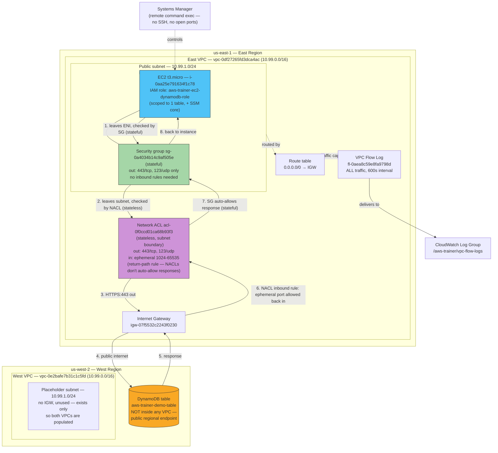

# AWS Training — Cross-Region EC2 → DynamoDB Hands-On

A record of the hands-on lab built step by step: two VPCs (us-east-1 "east",
us-west-2 "west"), an EC2 instance in the east VPC reached via SSM (no SSH),
an IAM role scoped to one DynamoDB table, a DynamoDB table in the west
region, a proven cross-region connection between them, and VPC Flow Logs
used to validate the traffic at the network layer.

## Architecture

**Two layers, deliberately made visible.** The subnet originally used the
VPC's *default* NACL, which silently allows everything — traffic was
already "crossing a NACL," just an invisible one doing nothing. A custom
NACL (`acl-0f0ccd01ca68b93f3`) replaces that default, with only the two
outbound rules this lab's traffic actually needs (443/tcp, 123/udp) — and,
critically, matching **inbound** rules for the ephemeral port range, since
NACLs are **stateless**: allowing a request out does not automatically
allow its response back in, unlike the security group. The SG's own
default "allow all outbound" rule was likewise replaced with the same
scoped 443/123 set, with **no matching inbound rule needed** on the SG
side — the direct side-by-side contrast is the point: same intent
(scoped egress), two different enforcement models (stateless per-subnet
vs. stateful per-ENI).

**Why it looks like this, not simpler:** DynamoDB is a regional managed
service, not a resource that lives inside a customer VPC — it can't be
reached via VPC peering the way an EC2/RDS instance in another VPC could.
Since the table (west) and the VPC (east) are in different regions, the
same-region-only VPC Gateway Endpoint option is off the table, leaving the
public-endpoint-over-the-internet path as the only real option — hence the
Internet Gateway (chosen over a NAT Gateway specifically to avoid its
~$0.045/hr recurring cost) and the security group with zero inbound rules
(nothing needs to reach *in* to the instance — SSM handles remote access
outbound-only).

## Account setup

1. **AWS CLI** installed locally (`brew install awscli`).
2. **Credentials**: an IAM-style access key was placed in `~/.aws/credentials`
   under `[default]` — in practice this ended up being the account's **root**
   user credentials, not a dedicated IAM user. That's a known gap, not a
   recommended pattern — create a scoped IAM user for real use.
3. **Region fix**: `~/.aws/config` initially had `region = west`, an invalid
   region code, causing `EndpointConnectionError` on `sts.west.amazonaws.com`.
   Fixed to `region = us-east-1`.
4. **Root MFA**: AWS enforces mandatory MFA for root users account-wide.
   Passkey/security key is one option; an authenticator app (TOTP) is an
   equally valid alternative if passkey registration is inconvenient.

## Bedrock exploration (before pivoting to the VPC/EC2/DynamoDB lab)

- `aws_ws/examples/04_bedrock_list_models.py` lists foundation models visible
  in-account (read-only, free) — 122 models were visible across many
  providers, including several current-gen Anthropic Claude models
  (`anthropic.claude-sonnet-5`, `anthropic.claude-haiku-4-5-...`, etc.)
- Actual invocation (`Converse`/`InvokeModel`) failed with
  `AccessDeniedException: Your account is currently being verified`,
  and later `ValidationException: Operation not allowed` for every model,
  including Amazon's own Nova Micro.
- Root cause, confirmed via `list-service-quotas` for `ServiceCode=bedrock`:
  **on-demand inference quotas were 0 for every model** on this account —
  standard for a brand-new AWS account until AWS's automated trust/spend
  verification completes. A `request-service-quota-increase` attempt for
  Claude Haiku 4.5 failed with `IllegalArgumentException: You must provide a
  quota value greater than the default quota value of 10000.0` — confirming
  the *standard* default for that quota is 10,000/min, and the account's
  effective 0 was a temporary suppression, not a real quota ceiling. This
  needs AWS Support / billing verification to clear, not a quota request.
- Current Bedrock on-demand pricing (per million tokens, as of ~2026-09):
  Claude Haiku 4.5 $1/$5, Claude Sonnet 5 $2/$10 (promo through 2026-08-31,
  then $3/$15), Claude Sonnet 4.6 $3/$15, Claude Opus 4.8 $5/$25, Amazon
  Titan Text Lite $0.30/$0.40, Titan Text Express $0.80/$1.00.
- A local Streamlit chat app (`aws_ws/bedrock_chat_app/`) is built and ready
  to use once Bedrock access clears — not part of this VPC/EC2 lab's
  resource set.

## Step 1 — Bare VPC creation pattern

`aws_ws/examples/05_vpc_basics.py` establishes the base pattern used
throughout: a VPC tagged `Name=aws-trainer-demo-vpc`, `CIDR 10.99.0.0/16`,
created with **zero attached resources** (no subnet, no gateway) so it has
no delete-blocking dependencies. Supports `create` / `list` / `delete`
per-region.

- East VPC (us-east-1): `vpc-0df27265fd3dca4ac`
- West VPC (us-west-2): `vpc-0e2bafe7b31c1c5fd`

## Step 2 — Architecture decision: DynamoDB is not "inside" a VPC

DynamoDB is a regional managed service, not something that runs inside a
customer VPC — it can't be reached via VPC peering the way an EC2/RDS
instance in another VPC can. Two real options for a VPC resource to reach
it:

- **Same-region: VPC Gateway Endpoint** — free (no hourly or per-GB
  charge), fully private, no NAT/IGW needed. Only works when the VPC and
  the DynamoDB table are in the **same region**.
- **Cross-region: public endpoint over the internet** — the VPC's subnet
  needs real internet egress (Internet Gateway + public IP, or a NAT
  Gateway for a private subnet). This is the only option when the table is
  in a different region than the VPC, which is the case here (east VPC,
  west table) — so this lab uses this path.

NAT Gateway (~$0.045/hr + $0.045/GB) was deliberately avoided by giving the
EC2 instance's subnet a route straight to an **Internet Gateway** (free)
and a public IP, since production-grade privacy wasn't a goal for this
lab and cost was.

## Step 3 — Full resource build

`aws_ws/examples/06_ec2_to_dynamodb_cross_region.py create --east-vpc-id
vpc-0df27265fd3dca4ac --west-vpc-id vpc-0e2bafe7b31c1c5fd` created, in order:

1. **DynamoDB table** `aws-trainer-demo-table` (us-west-2, `PAY_PER_REQUEST`,
   partition key `id` (String))
2. **East subnet** `subnet-0f3554f60ec4bbe8e` (`10.99.1.0/24`,
   `MapPublicIpOnLaunch=true`) + **Internet Gateway**
   `igw-07f5532c2243f0230` + a route table routing `0.0.0.0/0` to the IGW
3. **West placeholder subnet** `subnet-096a87d323480c25c` (`10.99.1.0/24`)
   — intentionally has no IGW/route table; it exists only so both VPCs are
   populated, not because anything runs there
4. **Security group** — outbound-only; deliberately **no inbound rules at
   all**, since SSM needs no open ports
5. **IAM role** `aws-trainer-ec2-dynamodb-role` with:
   - `AmazonSSMManagedInstanceCore` (managed policy, for Session Manager)
   - An inline policy scoped to exactly the one table's ARN for
     `PutItem`/`GetItem`/`Scan`, plus unrestricted `ListTables` (DynamoDB's
     `ListTables` action has no resource-level permission support)
6. **EC2 instance** `i-0aa25e791634f1c78` — `t3.micro`, latest Amazon Linux
   2023 AMI (resolved via the public SSM parameter
   `/aws/service/ami-amazon-linux-latest/al2023-ami-kernel-default-x86_64`),
   launched into the east subnet with the IAM instance profile attached

## Step 4 — Connectivity test (API layer)

`06_ec2_to_dynamodb_cross_region.py test --instance-id i-0aa25e791634f1c78`
uses **SSM `send-command`** (`AWS-RunShellScript`) to run, on the instance
itself, an `aws dynamodb put-item` followed by `get-item` against the west
table — no SSH, no key pair. Result: **succeeded**, item written and read
back correctly, proving the IAM role + network path both work.

Manual/interactive version (for exploring by hand): install the Session
Manager plugin (`brew install --cask session-manager-plugin`), then
`aws ssm start-session --target i-0aa25e791634f1c78 --region us-east-1`
drops into a real shell on the instance where the same `aws dynamodb ...`
commands can be run by hand.

## Step 5 — VPC Flow Logs (network-layer validation)

To validate the *network path* itself, not just the API call succeeding:

1. IAM role `aws-trainer-vpc-flow-logs-role` created, trusted by
   `vpc-flow-logs.amazonaws.com`, with an inline policy scoped to only
   `logs:CreateLogGroup`/`CreateLogStream`/`PutLogEvents`/`DescribeLog*` on
   the specific log group ARN used below.
2. Flow log `fl-0aea8c59e8fa9798d` created on the east VPC
   (`TrafficType=ALL`, destination `cloud-watch-logs`, log group
   `/aws-trainer/vpc-flow-logs`, default 600s aggregation interval — so
   records can take up to ~10 minutes to appear after traffic occurs).
3. Validated flow log records with `aws logs tail
   /aws-trainer/vpc-flow-logs --since 30m`, then cross-referenced
   destination IPs against AWS's published IP ranges
   (`ip-ranges.amazonaws.com/ip-ranges.json`) to prove, at the packet
   level, that `10.99.1.178 <-> 35.71.64.124:443` was genuinely
   `DYNAMODB` / `us-west-2` traffic — not just trusting the API call
   result. Unsolicited inbound scan traffic on the instance's public IP
   was correctly seen as `REJECT`ed by the security group's lack of
   inbound rules — a secondary confirmation the security group works as
   intended.

## Step 6 — Explicit NACL + SG layers (network-layer defense in depth)

`aws_ws/examples/07_nacl_sg_layers.py create --vpc-id vpc-0df27265fd3dca4ac
--subnet-id subnet-0f3554f60ec4bbe8e --sg-id sg-0a4034b14c9af505e
--instance-id i-0aa25e791634f1c78` made the east subnet's security
enforcement explicit instead of relying on defaults:

1. **Custom NACL** `acl-0f0ccd01ca68b93f3` created and associated with the
   east subnet (replacing the default NACL association). Rules:
   - Outbound: allow `443/tcp` and `123/udp` to `0.0.0.0/0`
   - Inbound: allow `1024-65535/tcp` and `1024-65535/udp` from `0.0.0.0/0`
     — the **return-path rule a stateless NACL requires**. Without this,
     outbound requests would leave fine but every response would be
     silently dropped (connections would just hang, not fail loudly).
2. **Security group** `sg-0a4034b14c9af505e`'s default "allow all
   outbound" rule was revoked and replaced with the same scoped set
   (`443/tcp`, `123/udp`) — but **no matching inbound rule was needed**,
   since security groups are **stateful**: a response to traffic the SG
   already allowed out is automatically permitted back in.
3. Re-ran the DynamoDB connectivity test
   (`aws dynamodb put-item`/`get-item` via SSM) — **succeeded**, proving
   the request genuinely passes both layers now (previously-implicit
   default-NACL allow-all, now an explicit, minimal, auditable rule set
   at both the subnet boundary and the ENI).

**Stateless vs. stateful, made concrete:** this is the practical
difference between NACLs and security groups that's easy to state
abstractly and easy to get wrong in practice — forgetting the NACL's
inbound ephemeral-port rule is a classic real-world "why can requests go
out but responses never come back" bug. Reproducing it here (rather than
just describing it) is the actual teaching value of this step.

## Full resource inventory (for cleanup / reference)

| Resource | ID | Region |
|---|---|---|
| East VPC | `vpc-0df27265fd3dca4ac` | us-east-1 |
| East subnet | `subnet-0f3554f60ec4bbe8e` | us-east-1 |
| Internet Gateway | `igw-07f5532c2243f0230` | us-east-1 |
| West VPC | `vpc-0e2bafe7b31c1c5fd` | us-west-2 |
| West subnet (placeholder) | `subnet-096a87d323480c25c` | us-west-2 |
| DynamoDB table | `aws-trainer-demo-table` | us-west-2 |
| EC2 instance | `i-0aa25e791634f1c78` | us-east-1 |
| IAM role (EC2) | `aws-trainer-ec2-dynamodb-role` | global |
| IAM instance profile | `aws-trainer-ec2-dynamodb-profile` | global |
| IAM role (Flow Logs) | `aws-trainer-vpc-flow-logs-role` | global |
| VPC Flow Log | `fl-0aea8c59e8fa9798d` | us-east-1 |
| CloudWatch Log Group | `/aws-trainer/vpc-flow-logs` | us-east-1 |
| Security group | `sg-0a4034b14c9af505e` | us-east-1 |
| Custom NACL | `acl-0f0ccd01ca68b93f3` | us-east-1 |

## Cleanup

Run `python cleanup.py` (see that file in this repo) to remove every
resource above in the correct dependency order. Confirmed $0 cost drivers
throughout except the EC2 instance itself (free-tier eligible, or a few
cents/hour if not) — terminate it promptly once done exploring.
