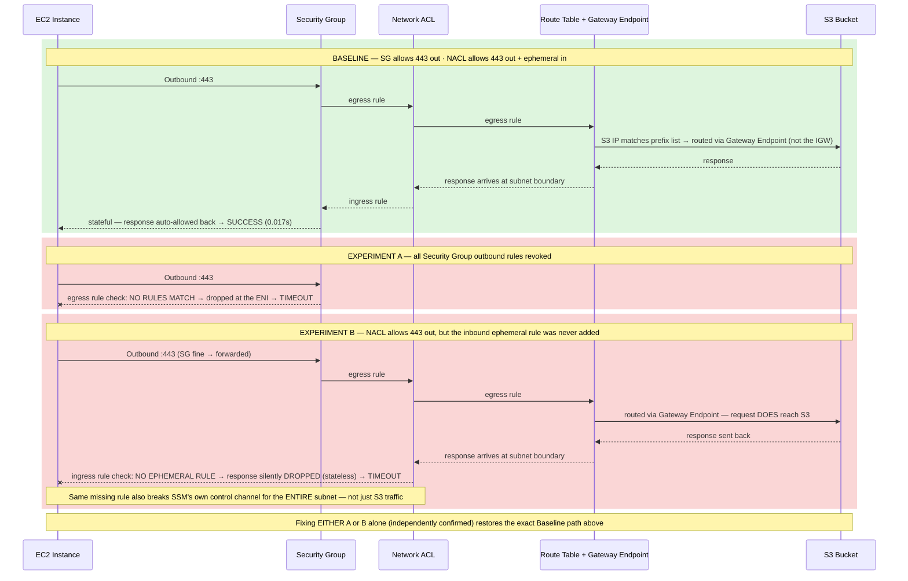

# S3 Gateway Endpoint Timeout — Exam Scenario, Reproduced Hands-On

**Question:** A VPC in us-east-1 has a Gateway VPC Endpoint for S3,
associated with the **main route table**, which is attached to a public
subnet. An EC2 instance in that subnet tries to access an S3 bucket in the
same region and the request fails with a **timeout**. Which two things are
most likely wrong?

**Answer:** (A) the Security Group doesn't allow outbound 443, and (B) the
Network ACL doesn't allow the necessary traffic (specifically the inbound
ephemeral-port return-path rule). A restrictive endpoint policy or missing
IAM permission would cause **Access Denied**, not a timeout.

This isn't just asserted — every state below was actually built and tested
via `aws_ws/examples/08_s3_gateway_endpoint_timeout_scenario.py`.

## The three scenarios, grouped by phase with the specific action at each hop

**What this shows that a topology diagram can't:** the request in Experiment B genuinely **reaches S3 and gets a response** — the failure isn't "can't connect," it's "the response can't get back in." That's the concrete, mechanical reason a stateless NACL misconfiguration produces a timeout that looks identical from the EC2 instance's side to Experiment A's failure, even though the two are broken in opposite directions (A blocks the request from ever leaving; B blocks the response from ever arriving).

**Key point the question is testing:** the Gateway Endpoint only changes
*which route* S3-bound traffic takes (step 4 — via the endpoint instead of
the Internet Gateway). It does **not** bypass the Security Group (step 1)
or the Network ACL (step 2/7) — both are evaluated exactly the same way
regardless of which route the traffic ultimately takes.

## Empirical proof — three states, all tested live

| State | Change from baseline | Result |
|---|---|---|
| **Baseline** | SG allows 443 out; NACL allows 443 out + ephemeral in | ✅ `aws s3 ls` succeeded, curl responded in 0.017s |
| **A — SG broken** | Revoked all SG outbound rules | ❌ **Timeout** (both `aws s3 ls` and curl) |
| A fixed | Restored SG outbound 443 | ✅ Works again (0.017s) |
| **B — NACL broken** | NACL allows outbound 443, but the inbound ephemeral return-path rule was left out | ❌ **Timeout** — and this also silently broke the SSM control channel on the whole subnet, since NACLs apply to *all* traffic in the subnet, not just the traffic being tested |
| B fixed | Added the missing inbound ephemeral rule | ✅ Works again (0.016s) |

**Why "Access Denied" is the wrong mental model here:** an overly-restrictive
S3 bucket policy, endpoint policy, or missing IAM permission would all
produce an explicit `403 Access Denied` — the request *reaches* S3 and gets
a clear rejection. A **timeout** means the request never got a response at
all, which points at the network layers (SG/NACL) sitting between the
instance and the endpoint, not at authorization.

**Extra teaching point from state B:** breaking a subnet's NACL has a
**blast radius of the entire subnet** — every resource and every kind of
traffic in it, not just the one thing you meant to break. A Security Group
misconfiguration, by contrast, is scoped to just the ENIs it's attached to.
This is a sharper practical reason to be more careful with NACLs than SGs,
beyond the stateless/stateful distinction alone.

## Resources created for this scenario (see `08_s3_gateway_endpoint_timeout_scenario.py` for full create/break/fix/delete lifecycle)

| Resource | ID |
|---|---|
| VPC | `vpc-053908c4460150d9f` |
| Subnet | `subnet-095efb30769cd25f7` |
| Main route table | `rtb-009825f76a0d50710` |
| Security group | `sg-07fbe63cde49763e9` |
| Network ACL | `acl-08132fa257e30fa19` |
| S3 Gateway Endpoint | `vpce-0bd665227fffbfead` |
| EC2 instance | `i-042da759ae55e1302` |
| S3 bucket | `aws-trainer-s3-endpoint-demo-1788625046` |
| IAM role | `aws-trainer-s3-endpoint-ec2-role` |

AWS's own VPC console also renders a live visual "Resource map" for any
VPC (VPC console → your VPC → **Resource map** tab → toggle **Show all
details**) — worth viewing directly in the console alongside this diagram.
